# GPS-Tracker

<github>View how this project is meant to be displayed at https://jaycar.com.au/gps-tracker </github>

Build your own GPS tracker:

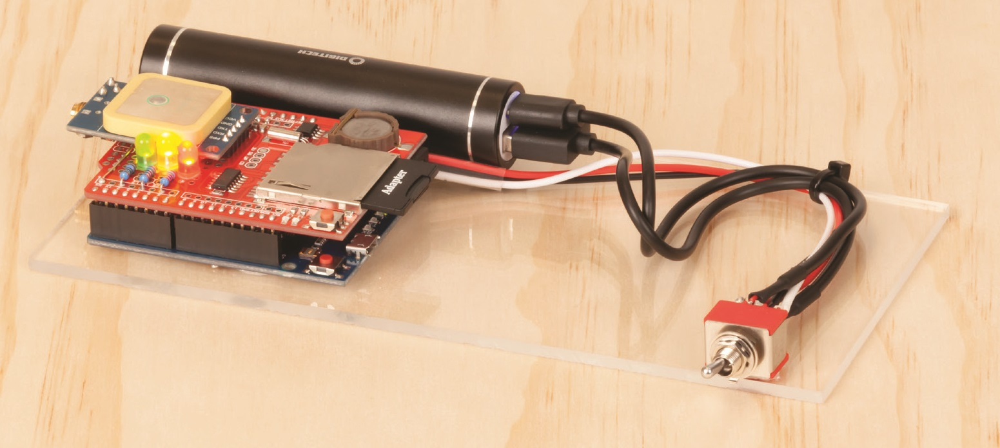

With [Electronjs](https://electronjs.org/) powered software:

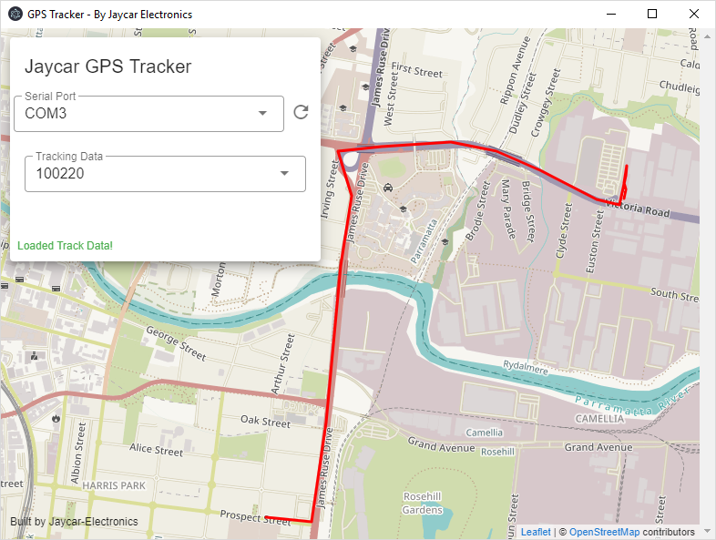

## Table of Contents

- [GPS-Tracker](#GPS-Tracker)
  - [Table of Contents](#Table-of-Contents)
  - [Bill of Materials](#Bill-of-Materials)
    - [You might also want](#You-might-also-want)
  - [System Overview](#System-Overview)
  - [Building the Tracker](#Building-the-Tracker)
    - [Removing female headers (optional)](#Removing-female-headers-optional)
    - [Connecting up LEDs](#Connecting-up-LEDs)
    - [Placing GPS Module](#Placing-GPS-Module)
      - [Preparing the LEONARDO](#Preparing-the-LEONARDO)
    - [Formatting the card](#Formatting-the-card)
    - [Preparing the Power supply](#Preparing-the-Power-supply)
    - [Connecting it all together.](#Connecting-it-all-together)
    - [Installing the GPS Software](#Installing-the-GPS-Software)
  - [Use and Troubleshooting](#Use-and-Troubleshooting)
    - [Computer Mode](#Computer-Mode)
    - [Tracking Mode](#Tracking-Mode)
    - [Complete example use](#Complete-example-use)
  - [Developing and Extending](#Developing-and-Extending)
    - [Recommended developing setup](#Recommended-developing-setup)
  - [Read More](#Read-More)

## Bill of Materials

| Qty | Code                                     | Description        |
| --- | ---------------------------------------- | ------------------ |
| 1   | [XC4989](https://jaycar.com.au/p/XC4989) | 16Gb SD Card       |
| 1   | [XC4430](https://jaycar.com.au/p/XC4430) | Leonardo           |
| 1   | [XC4536](https://jaycar.com.au/p/XC4536) | Datalogging Shield |
| 1   | [XC3710](https://jaycar.com.au/p/XC3710) | GPS Receiver       |
| 1   | [ZD0150](https://jaycar.com.au/p/ZD0150) | RED Led            |
| 1   | [ZD0169](https://jaycar.com.au/p/ZD0169) | Orange Led         |
| 1   | [ZD0170](https://jaycar.com.au/p/ZD0170) | Green Led          |
| 1   | [RR0552](https://jaycar.com.au/p/RR0552) | 150 Ohm Resistors  |
| 1   | [MB3793](https://jaycar.com.au/p/MB3793) | Power Bank         |
| 1   | [ST0505](https://jaycar.com.au/p/ST0505) | 3PDT Switch        |

### You might also want

- [WH3032](https://jaycar.com.au/p/WH3032) Solid core wire, especially in [Preparing the LEONARDO](#Preparing-the-LEONARDO)
- [WH5524](https://jaycar.com.au/p/WH5524) Heatshrink pack to keep some wires together, (handy for any workbench)

## System Overview

This project works in two stages. Firstly the project is set up to record GPS information when you are out on a trip; This could be in the car or on the bike; the GPS is set to record the coordinates every 10-20 seconds and can be easily configured in the main `tracker.ino`.

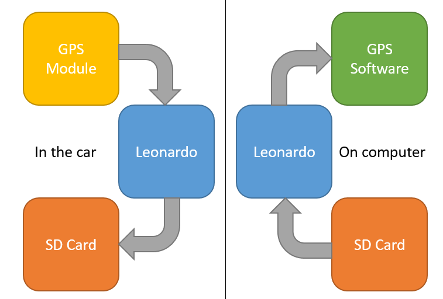

After-which, you can take it home and plug it into the computer. With the supplied GPS software, you will be able to plot the GPS-coords on a map. The GPS software is set up to check for new _Serial_ devices and ask them for tracking information.

The general systems are connected as followed:

|                   | Leonardo Connection                 |
| ----------------- | ----------------------------------- |
| SD Card Module    | SPI pins (13,12,11), Chip Select 10 |
| Status LEDs       | Red 6, Orange 5, Green 4            |
| GPS Receiver      | Serial Receive (D0 or "RX")         |
| Battery Discharge | A0                                  |

The battery discharge is just a simple switch to let us know if the GPS tracker is powered by the [MB3793](https://jaycar.com.au/p/MB3793) power bank, or the USB connection to the computer. While it's connected to the computer, it will charge the battery (see ["Preparing the Power supply"](#Preparing-the-Power-supply) for a cool animation).

## Building the Tracker

### Removing female headers (optional)

Firstly, a _completely optional_ step: if you want to remove the female header pins on the top of the datalogging shield, you can do so by mounting the shield in the leonardo, then bending back and forth the header row:

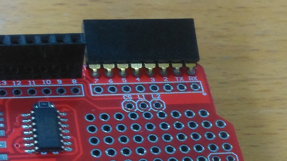

Once it breaks off, you can clean up the joints by using a small blob of solder over the broken metal; This neatens the join but also makes it stronger, but be careful not to melt the header pins on the leonardo by leaving the heat on for too long.

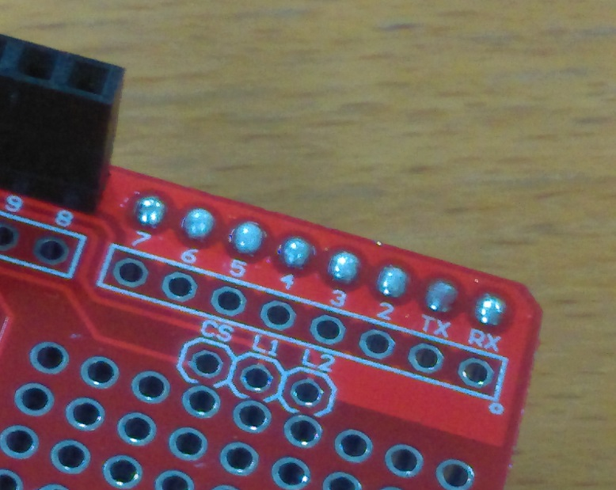

### Connecting up LEDs

Next up, for connecting the LEDs, we are going to use our 150 ohm resistors connected into pins 3, 5, and 6. Use a pair of pliers to bend the leads of the resistos first, before you put them in.

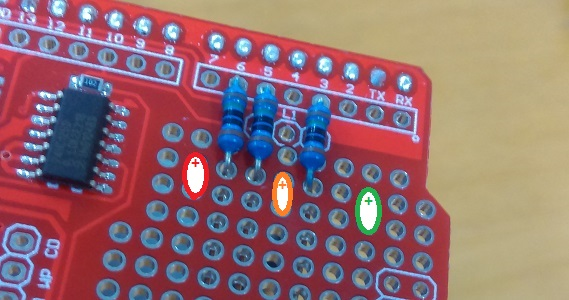

We've also marked where the LEDs go, you must make sure that the positive side (the leg of the LED which is longer) must go closer to the resistors, as marked by the '+' sign.

From here, the Red Positive leg attaches to the resistor on pin 6, Orange positive to resistor on pin 5, and Green positive to resistor on pin 3. Our soldering is shown below:

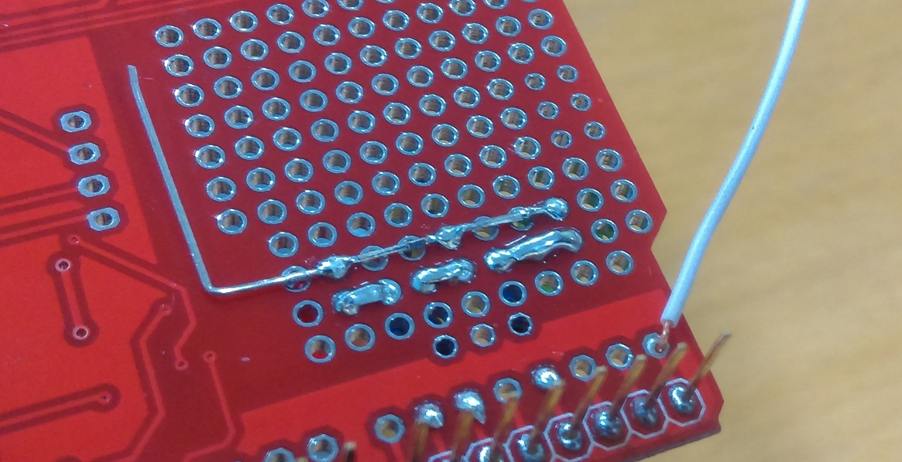

We've also attached all of the negatives to go up the board, with the final RED negative lead bent at 90 degrees to be used later.

Use some [WH3032](https://jaycar.com.au/p/WH3032) solid core wire to attach into the RX pin, we'll need this to receive serial data from the GPS later.

### Placing GPS Module

First, either bend or re-solder the header pins on the [XC3710](https://jaycar.com.au/p/XC3710) GPS module so that they are straight.

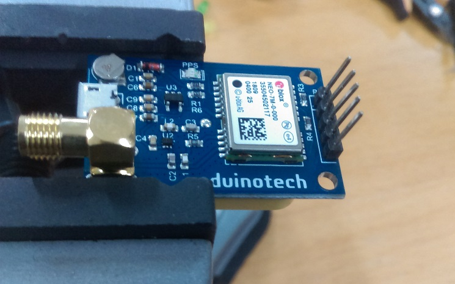

Then place the GPS module into the datalogging shield, in the last row, close to the analogue pins. You should find that it will fit just besides the LEDs that you have placed; In our photo below, we don't have the LEDs yet connected:

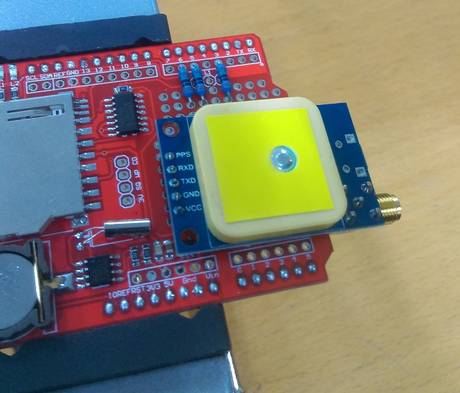

You can see that the bottom 3 pins are all we need in order to use the GPS module: VCC, GND, and TX (for Serial Transmission)

Solder in the GPS module at one or two spots to keep it in place, then follow the schematic below (looking at the underside of the shield).

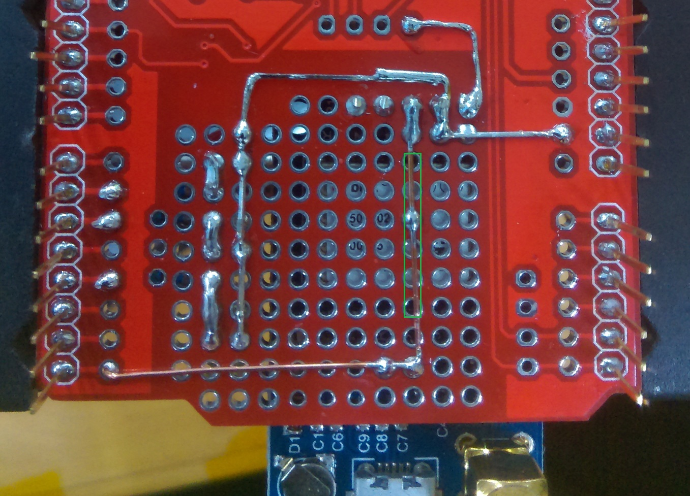

- VCC is connected to the 3V pin on the shield, which is a suitable voltage to use on the GPS.
- GND is connected to both the LED negative legs from before, and to the 5V on the edge of the shield. Use some left over resistor legs to make the connection and keep it neat.
- TX is connected to the RX from before; we have removed the shielding and soldered it at some points to keep it close to the board, but it is probably best to keep the marked section covered, so that it doesn't short through to the case of the GPS (and thus ground).

Once the 3 LEDs and the GPS module are connected, the shield is complete; we just need a slight modification on the leonardo to get it working as expected..

#### Preparing the LEONARDO

Unfortunately, the designers of the Leonardo board did not route SPI pins through to standard 13,12,11 pins; so we need to do some slight modification to our board to get it to read from SD card.

With some short lengths of solid core wire (solid-core is highly recommended as the wires can't splay everywhere and cause a short circuit) - Connect Pins 13,12, and 11 to the ISCP header as shown below.

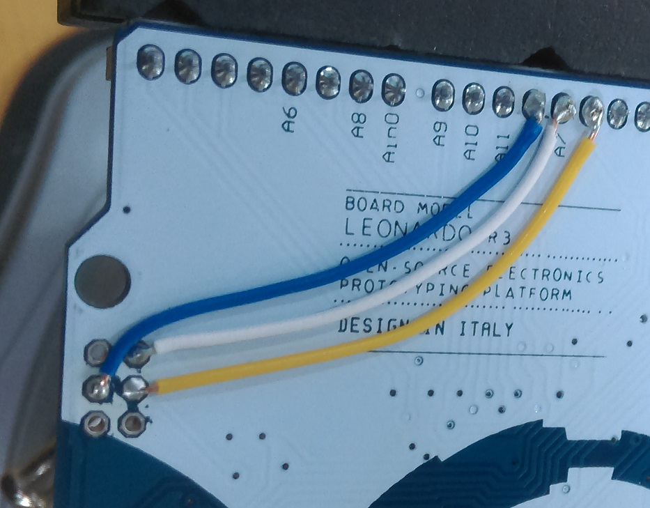

To make it easier, you can first remove the ISCP pins from the board by heating up the solder and pulling them out, then cleaning residual solder with some solder wick such as [NS3027](https://jaycar.com.au/p/NS3027).

Doing this makes the leonardo board act like the uno in regard to SPI, but you will have to replace the header pins if you need to use the ISCP in the future.

### Formatting the card

Depending on the size of the SD card, you might have it already set as NTFS filesystem. We need it to be FAT32 to work with this code, so insert it into your computer and find the device in your Explorer.

Once you've found it, right click and press "Format". Make sure the file system is set as FAT32 and press "Start".

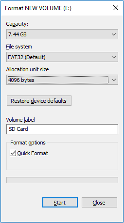

If you are using larger cards you might not get the option to use FAT32 in the windows software, but you will be able to use FAT32 if you use different software. Search for "Format FAT32 64GB card" or similar and you should find some software that will be able to format larger cards, but keep in mind that this system will probably need only 200Kb per day of tracking, ( which for 8Gb, is about _40 thousand days_).

### Preparing the Power supply

For the power supply, we are going to use the [ST0505](https://jaycar.com.au/p/ST0505) switch to switch between the OUTPUT and INPUT of the battery charge bank. We use the 3rd pin to signal to the Arduino whether we are using the battery bank or not, just so we can set which "mode" we want to be in; to either log data to, or read data from, the SD card.

You will need to cut the supplied USB cable that came with the [MB3793](https://jaycar.com.au/p/MB3793) and strip the two wires inside on both ends of the lead, so that it looks something like this:

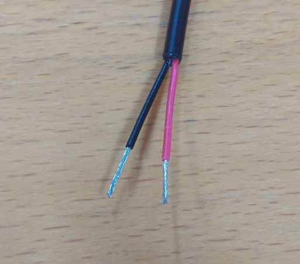

We will be connecting both ends of the USB lead to the switch, and plugging both ends into the [MB3793](https://jaycar.com.au/p/MB3793) battery bank.

The schematic for the switch is like such:

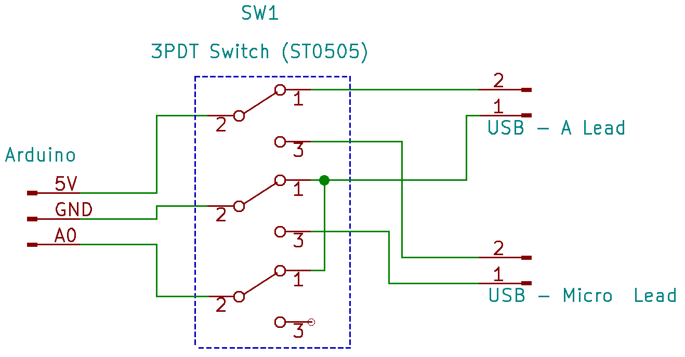

Basically, you should see 3 lots of 3 on the bottom of your switch; these are configured like 3 separate SPDT switches; two of which we use as power, and the final one we either ground or leave floating. In software, we use `pinMode(A0,INPUT_PULLUP);` so that the switch is left "HIGH" when not connected (floating) - or GROUND when the switch is turned on.

The benefit of this system is that arduino will know where it's getting it's power from, and if the unit is turned "OFF" while connected to the computer, it will also charge the battery bank.

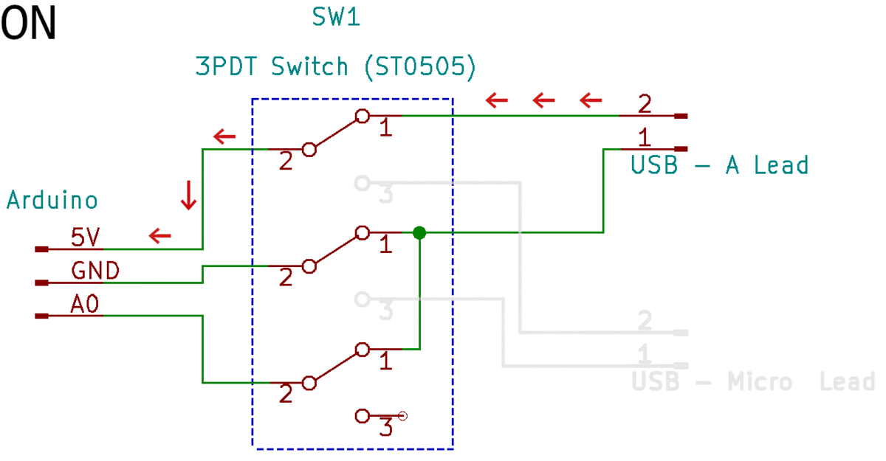

In terms of wiring this up on the switch, it is pretty easy. The middle row accounts for the pin "2" in the schematic, and the top and bottom are 1 and 3.

The switch pins are rectangular and flat, and are laid out horizontally; It was a little difficult to get the photos of the switch, so take this visual representation instead:

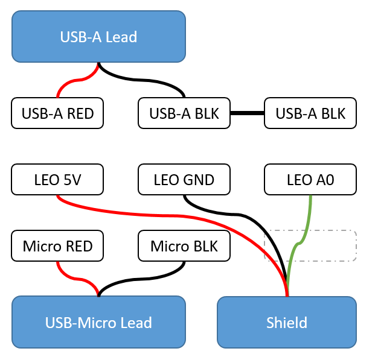

This is what the bottom of the switch should look like; the 3 leads going to the shield can be bundled together if needed; in our photo at the top of the page we used some clear heatshrink to keep it together. Notice that the bottom right pin is unused, which matches the schematic as one of the pins is left floating, and there is a bridge between the top middle and right pins.

### Connecting it all together.

You should have 3 components now:

1. The Leonardo, with the ICSP modification to pins 11,12,13.
2. The Shield, with 3 LEDs and GPS connected.
3. The power bank, with both USB connectors plugged in, connected to the switch, and 3 leads coming off it (VCC,GND,A0)

Simply solder the 3 leads from the switch to the shield in the 5V, GND, and A0 pins. You can use some heatshrink to keep the switch leads together.

### Installing the GPS Software

We have put a windows binary for the GPS software on Github under "releases" tab; which you can click [here](https://github.com/Jaycar-Electronics/GPS-Tracker/releases)

Download the software and run it. It should open up with no problems; You won't have much data to view though until you use the GPS tracker, which is shown next.

## Use and Troubleshooting

When the switch is set `OFF` you should find that the unit has no power; Connect it up to the computer and program the Leonardo as normal, by opening the project in the arduino IDE, set the board type to `Leonardo`, and select the correct port.

Once the Leonardo has rebooted and programmed successfully; you should find all LEDs turn on, which mean that it is "Computer Mode"

### Computer Mode

You can open up the serial monitor and type in some commands, but without tracking information it won't have much of a response.

| If you send | It should reply (with no data) |
| ----------- | ------------------------------ |
| `LIST`      | `LIST`                         |
| `READ`      | `DATA`                         |

If you find it replies "failed to init SD card" and you are sure the SD card is in the unit and formatted correctly, then submit an issue on github, as SD cards can sometimes have a bit of trouble.

We have provided a `TEST` file in the folder of the repo, which you can copy onto the SD card and use the serial monitor to test. Once it is placed on the SD card, insert the SD card into the unit, and connect it up (in command mode) so you can use the serial monitor:

| If you send | It should reply (with TEST data)            |
| ----------- | ------------------------------------------- |
| `LIST`      | `LIST TEST|`                                |
| `READ TEST` | `DATA 210103.00 3349.41957,15101.13422|...` |

See below for a screenshot:

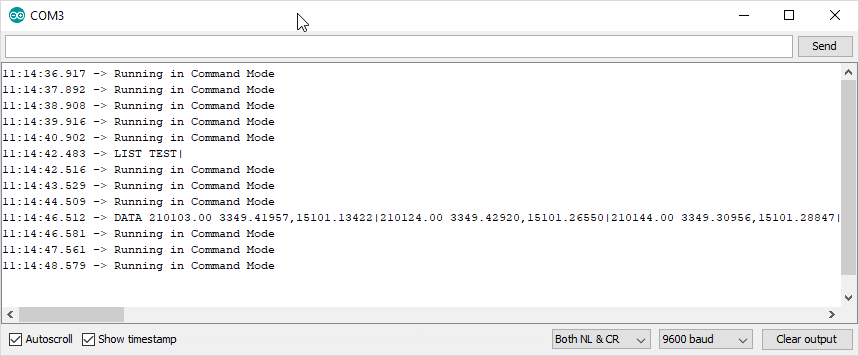

### Tracking Mode

Disconnect the tracker from the Computer and turn the switch `ON`, you should find that the Power LED is turned on, and the other LEDs will blink at certain times.

Generally speaking, the LEDs will flash once on success and multiple times on failure:

- _Orange LED_ is related to the SD Card
- _Green LED_ is related to the GPS.

You might get a few GPS failures until you take the unit out into the open air and leave it for a minute or so, just so it can get a good lock on satellite information. If it takes more than 5 minutes to get a lock, submit an issue and we can help you debug;

While in tracking mode, you should still be able to see some information on the serial monitor, which can help you see what's happening with the unit.

### Complete example use

Once it seems to be tracking successfully, take it for a walk around the block or put it in the dash of your car.

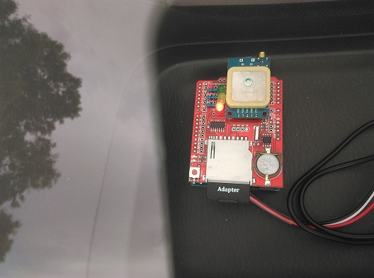

After a short trip, bring it back home, turn it `OFF` and connect it to the computer. then open up the GPS software and select the serial port.


You should find that it will return a list of tracking information. These are currently set to UTC time but we are working to make it local time as well.

If you find "Access Denied" that is most likely due to the serial port being blocked by Arduino, so make sure you close that, then you can close and re-open the software.

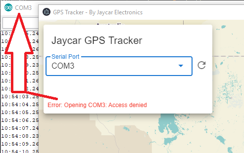

Once you select some tracking information, it will show up on the map and zoom to it, so you can see that complete track:


## Developing and Extending

We really love this project and we hope you do too. If you want to contribute, one of the best ways is to submit suggestions on how to improve the project via the "Issues" tab on Github. This could be anything from suggesting a rainbow-track, loading multiple tracks at once, or showing a little car animation along the track. Be sure to include as much information as what you want, and we can outline how to make the changes so that either you can have a go of hacking it yourself, or someone else might come along and contribute so they can put it on their resume.

To extend the GPS Tracker software, you have to install a few things to set up your computer. Firstly, head over to <https://nodejs.org> to install node on your computer. If you are using linux or mac, you can simply use your package manager to install `node`.

Then in a command prompt window (or terminal), type in:

```shell
cd gps-view
npm install
```

Which should set up the dependencies required to build the software. You can read the [README.md](gps-view/README.md) file in the `gps-view` folder to see more information about how to edit, build, and compile the example, there's a lot going on.

### Recommended developing setup

For developing the gps-view tracker software, we generally recommend using Microsoft VSCode from <https://code.visualstudio.com> as well as the following extensions for syntax highlighting:

- Prettier Code Formatting
- Vetur
- Vuetify-vscode

If you want to develop the Arduino application further, you could also install the Arduino extension and have a great editor for Arduino as well, which is what we use here at Jaycar. :smile:

## Read More

- NMEA Sentence information:
  - <http://aprs.gids.nl/nmea>
- C++ Passing Arguments by Reference:
  - <https://www.learncpp.com/cpp-tutorial/73-passing-arguments-by-reference/>
