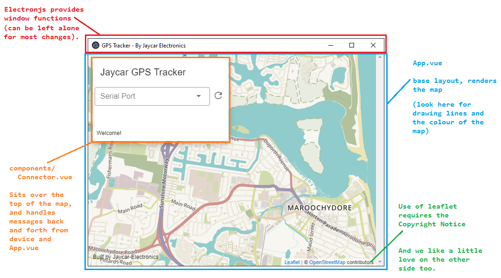

# GPS Tracker Software

This software was created using [electron.js](https://www.electronjs.org/), [vue.js](https://vuejs.org/) and open source mapping libraries [Leaflet - Open Street Map](https://leafletjs.com/), along with a host of other libraries.

If you've never done such a project before, it might be more productive to submit your requested changes as an [github issue](https://github.com/Jaycar-Electronics/GPS-Tracker/issues) and wait for someone else to make the changes -- We'll accept (almost) everything!

Otherwise if you just want to get started with hacking away and see what you can do, follow the steps below!

_Note:_ Most of the commands below are best done in a powershell window while VSCode is closed; there's issues with VSCode peeking at files while `npm` is trying to make changes to them.

## Setting up dependencies

To be able to make changes and run the development versions of the software (as well as bundle and compile your own version) you'll need the dependencies set up. Doing so is easy:

```powershell
npm install
```

## Code Overview

The core framework is vue.js to provide the classes and objects in our code, as well as manage the fundamental elements.

- <https://vuejs.org/v2/guide/>

Using Vue means that we can write our code in special `*.vue` files, which can be detected by an editor such as VSCode.

This is used in conjunction with vuetifyjs to give a bit of a framework on the layout and style of our app, as well as library made specifically for interacting Vuejs with Leafletjs called [Vue2Leaflet](https://github.com/vue-leaflet/Vue2Leaflet)

- <https://vuetifyjs.com/>
- <https://github.com/vue-leaflet/Vue2Leaflet>

Refer to vuetify for information on styling, buttons, position, and anything that looks "visual" -- to edit the map, and drawing on the map, have a look at the Vue2Leaflet code. The documentation for Vue2Leaflet is alittle tacky, but can be figured out with a little bit of elbow grease.

There's 3 main components to this project.

- the main.js, background.js and other "preamble"
  - Is best left alone for the most part, and will just act as setup scripts to get the project going.
- `App.vue`
  - Provides the map through leaflet, and is the parent element of everything.
- `Connector.vue`
  - Provides the little floating window, and manages connecting to the serial port through serial.js



We ask, if you are changing the look of the app, to please keep the bottom notice "Built by Jaycar-Electronics" and add your name to it, such as "Built by Jaycar-Electronics and @username" -- just so more people can find it. We're happy to accept your changes as long as it compiles and works fine.

## Running the GPS software

There's two ways to run the software, development or production. Generally we leave production until the last step, when we're ready to produce an .exe; Development mode brings in "hot-loading" so whenever we save changes, the system will automatically recompile the project and serve you the latest version, which is great for making quick changes to see how it affects the system.

### Development mode hotloading

```powershell
npm run electron:serve
```

will start the development server and will bring you an instance of the program. Any changes to the code will be reflected almost immediately; and if not, you can force a reload by using `Ctrl-Shift-R`.

### Bundling into .exe

Once you're happy with the changes and want to make an .exe to install onto your computer (or others). Simply run:

```powershell
npm run electron:build
```

Which will compile and place it in the `dist_electron/` folder. If you have some good changes, be sure to submit them to github and we can include it into the project, with your name on it!

If you get an error about unable to delete a file, close VSCode -- We've found, if VSCode is running, and you have already bundled once before, the compiler will not be able to delete the file as VSCode keeps it open. There's some related issues here: ([electron-builder#3666](https://github.com/electron-userland/electron-builder/issues/3666), [vscode#646](https://github.com/microsoft/vscode/issues/646), [electron#1658](https://github.com/electron/electron/issues/1658)) but so far we haven't found anything that works reliably other than just closing VSCode. Thankfully, building the .exe is a final step.

## Serial protocol information

The communication between the GPS tracker and the GPS View software is fairly simple. Not all functions are implemented but the core "View the track" details are there which is enough to work as a gps-tracker

All commands are sent from the GPS Software, responded to by the tracker.
All commands and responses are terminated by a newline line-feed, as done via the `println` command in arduino ('`\r\n`')

| Command             | Response (assumed successful)     | Description                                                                 |
| ------------------- | --------------------------------- | --------------------------------------------------------------------------- |
| `list`              | `LIST trackA|trackB|trackC|...|`  | returns a list of information that the GPS tracker has on SD card           |
| `read` _tracking_   | `DATA lat,long|lat,long|...|`     | returns a list of the GPS coords, taken from each interval (20s by default) |
| `delete` _tracking_ | _(not implemented, submit a PR!)_ | confirms the deletion of a certain track                                    |
| `clear`             | _(not implemented, submit a PR!)_ | confirms the deletion of all tracks                                         |

### Serial.js on the electron app

All serial information is managed by `components/Connector.vue` file. When the connector is "mounted" in vue, it runs the `mounted()` function, which calls `relistPorts()` and sets up the serial parser.

the list of ports will show up dynamically on the dropdown, however the system will not be able to detect when you have connected a new serial device to the computer. This will have to be amended some time in the future, possibly with a small "refresh" button or every 10 seconds or otherwise.

When the port is changed (via the dropdown) then the `serialport.js` then tries to connect to the port on 9600; sets up the parser, and writes `LIST` to the port, which according to the protocol above, will get the GPS tracker to respond with a list of track information.

When this track information is received, the `processListing()` function simply splits it per each '`|`' and displays in a new dropdown box.

When the track listing dropdown box is changed, the GPS software sends: `READ {trackingID}` which causes the tracker to respond `DATA 123.435,123.4352|...` - which the `processData()` function then splits into proper GPS co-ords.

- Note: GPS data from the GPS Module ([XC3710](https://jaycar.com.au/p/XC3710)) is in a (somewhat strange) degree-minutes-decimal format, which needs to be changed into a degree-decimal format, which is done in `processData()` somewhat hackedly.

From that, we "emit" a signal from the `Connector.vue` to say that we have `loadedTrack` which the `App.vue` then acts upon by using the `setTrack`;

```html
<l-control position="topleft">
  <connector @loadedTrack="setTrack"></connector>
</l-control>
```

If we haven't lost you by this point, then you're more skilled then we are.

`setTrack` is a function from `App.vue`, not the connector, which will handle the rendering of the polyline on the map. So to summarise in an itemised list:

1. `Connector.vue` connects to serial, asks for track information
2. **Tracker** responds, listing out GPS coords
3. `Connector.vue` gets the data, puts it in a proper degree-decimal format, then emits a _signal_
4. `App.vue` picks up the signal and the data from `Connector.vue` and calls `setTrack()`
5. setTrack adds a polyline to the map, with all the GPS information that it received.

That's a very quick rundown of what's going on. Goodluck on your hacking!

## How to create a new project with the same structure

If you want to make your own software, (doesn't even have to be related to the GPS tracker) then run these and start coding:

```sh
npm install @vue/cli      # To install the vue cli tool
vue create app-name-here  # tells vue to create a project
cd app-name-here
vue add electron-builder  # adds electron to the project
vue add vuetify           # adds vuetify to the project
npm run electron:serve    # Developer build and hotloading
```
